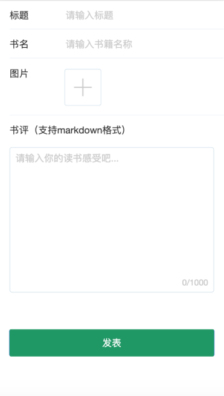

### 项目说明
本项目是使用Taro框架编写的前后端分离的lanyu书评项目,后端项目[lanyu_server](https://github.com/shiguangpaoqini/lanyu_server)

[线上地址](http://lanyu.agine.top)





### 环境依赖
1. node >= 9.6.0
2. npm

### 本地调试
```
h5调试
npm run dev:h5
```
